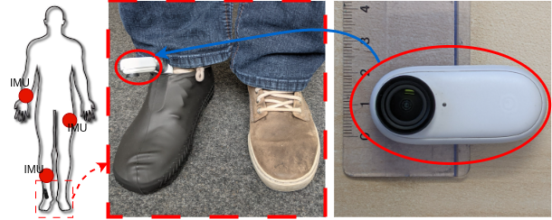
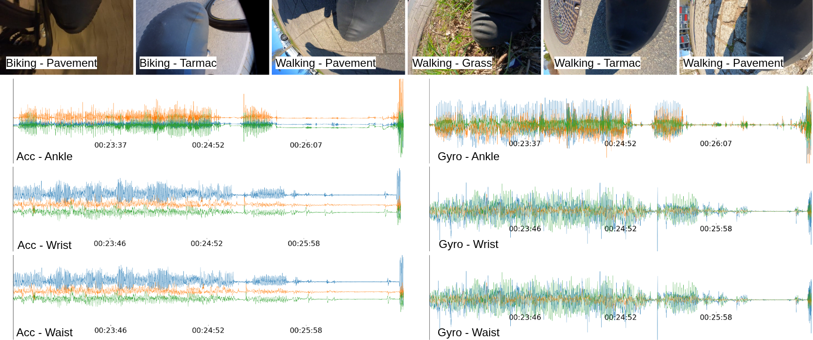

# FootSense

FootSense is a foot-centric multimodal sensing dataset that combines a downward-facing, shoe-mounted camera with three body-worn IMUs to jointly recognize locomotion activities and terrain types in unconstrained, real-world environments.

🚧 Under construction. The FootSense dataset is currently available. Baselines and additional documentation will be added in future updates.

## Dataset

The dataset is publicly available at:
[Download FootSense](https://cloud.dfki.de/owncloud/index.php/s/YeKRgR4TQ8Wj5K3)

### Sensor Placement

The sensing setup consists of a downward-facing camera mounted on the foot and three body-worn IMUs.

### Data Overview

<!-- Later: Dataset → Data Structure → Baselines → Citation → License -->